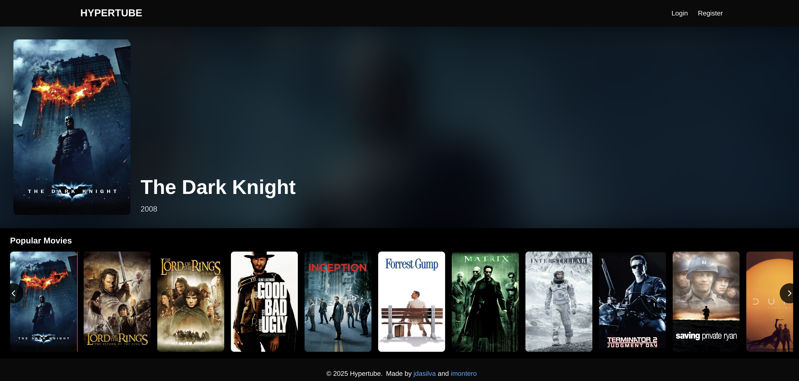
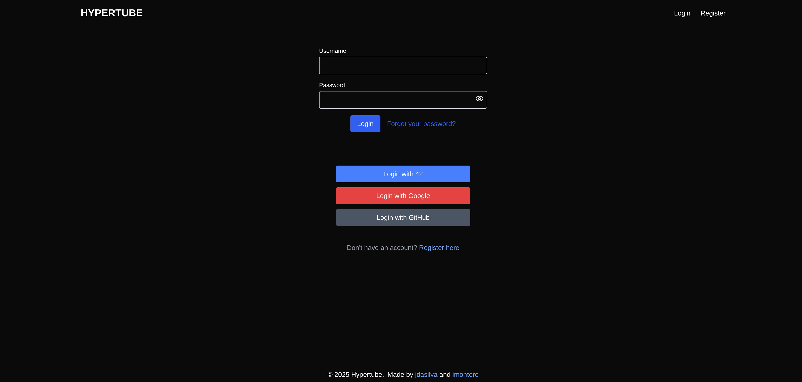
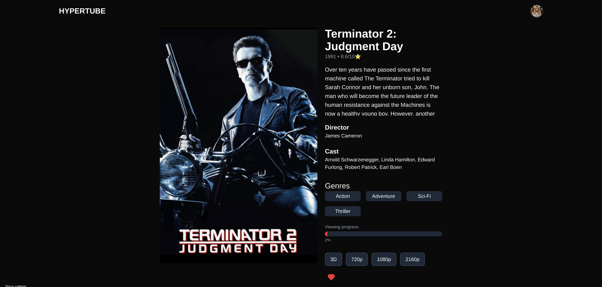
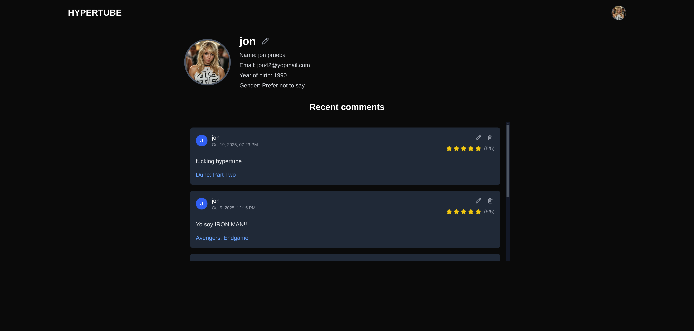
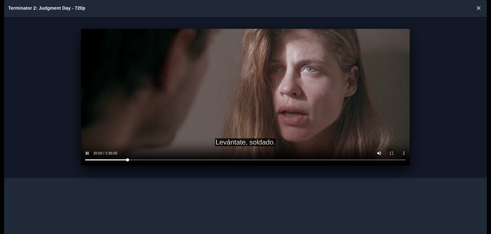

# HYPERTUBE
Hypertube es una plataforma de streaming estilo Netflix que permite a los usuarios buscar, ver en streaming y descargar películas a través del protocolo BitTorrent. La aplicación cuenta con autenticación de usuarios, descargas de torrents en tiempo real, obtención automática de subtítulos y una interfaz responsive.

## 🏗️  Arquitectura
El proyecto sigue una arquitectura de microservicios con tres componentes principales:

- Frontend: Next.js 15 con TypeScript y Tailwind CSS
- Backend: FastAPI con base de datos PostgreSQL
- Servicio de Torrents: Microservicio Python que gestiona descargas BitTorrent
- Cola de Mensajes: Apache Kafka para comunicación entre servicios

## ✨ Características Principales
 ### Gestión de Usuarios
    Autenticación OAuth (42, Google, GitHub)
    Registro e inicio de sesión con email/contraseña
    Gestión de perfil con subida de imágenes
    Soporte multiidioma (Inglés/Español)
    Generación de claves API para acceso programático

 ### Características de Películas
    Búsqueda y navegación de películas desde la API de YTS
    Filtrado avanzado (género, año, valoración)
    Streaming de torrents en tiempo real
    Descarga automática de subtítulos (Español/Inglés)
    Seguimiento del progreso de visualización
    Comentarios y valoraciones de películas
    Gestión de favoritos
    Lista de películas para continuar viendo

### Características Técnicas
    Autenticación basada en JWT
    Gestión de sesiones basada en cookies
    Sistema de revocación de tokens
    Progreso de descarga en tiempo real vía Kafka
    Servicio automático de limpieza de archivos
    Descarga secuencial para optimización de streaming
    Proxy de subtítulos para manejo de CORS

### 🔐 Características de Seguridad
    Autenticación con tokens JWT con expiración
    Sistema de revocación de tokens
    Hash seguro de contraseñas (bcrypt)
    Autenticación con claves API para acceso programático
    Gestión de sesiones basada en cookies
    Protección CORS
    Validación y sanitización de entradas

### 🎨 Características del Frontend
    Diseño responsive (mobile-first)
    Tema oscuro
    Internacionalización (i18n)
    Seguimiento de progreso en tiempo real
    Reproductor de video con soporte de subtítulos
    Scroll infinito
    Filtrado avanzado
    Optimización de imágenes

## 🚀 Opciones de Despliegue
    options:

    - for 1 server deployment:

        make standalone

    - for frontend deployment only:
            
        make front

    - for backend deployment only:

        make backend

